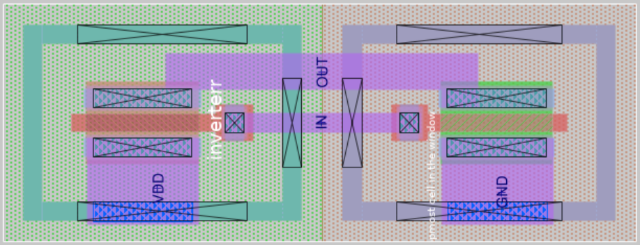

# Inverter - Analog IC Design

Proyek ini merupakan implementasi rangkaian **inverter** dalam desain IC analog menggunakan Magic dan Xschem. Inverter berfungsi membalikkan sinyal input digital menjadi output berlawanan, dan menjadi elemen dasar dalam berbagai rangkaian digital maupun analog.

## Preview Layout

## Simulasi & Pengujian

- Input: 0.8V pulse
- Delay: 2ns, Rise/Fall time: 2ns
- Pulse width: 50ns, period: 100ns
- Supply: 1.8V

## Hasil LVS
Skematik dan layout **match**

## Tools
- Xschem
- Magic VLSI
- Ngspice

